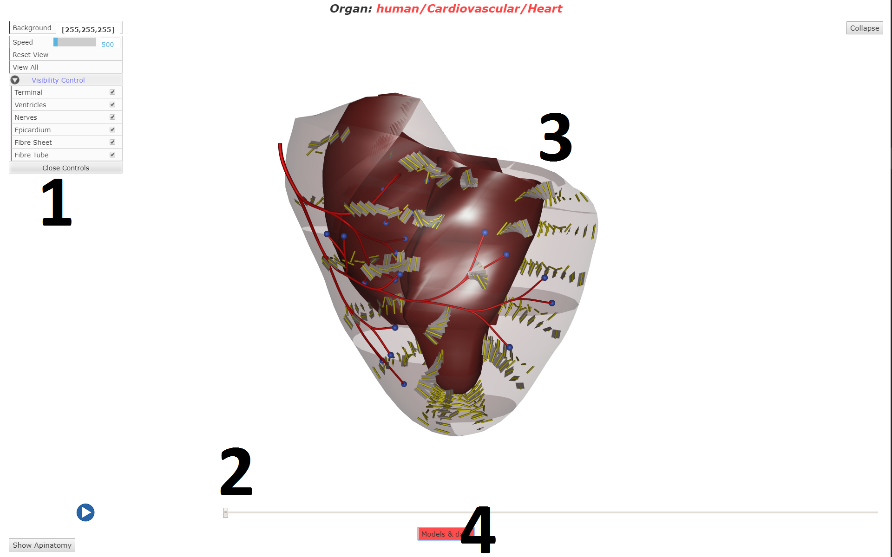

.. _organviewer:

Organ Viewer
=============

Organ Viewer is used for viewing models that users have previously selected on the body viewer.
If a matching anatomical model is found, the anatomical model will be displayed, otherwise the
geometry data similar to the one displayed on the body viewer will be displayed instead. 

   Expanded view of the Organ Viewer with a heart model on display: 
   
   1) :ref:`organgui`
   
   2) :ref:`organtimecontrol`
   
   3) :ref:`organrenderer`
   
   4) :ref:`organExternal`
   
.. _organgui:

Organ Control GUI
-----------------

Individual visibility settings for different parts of a model can be toggled using this interface by clicking on the tickbox.
In the case of the heart model, the visibility of different parts of a model such as terminal and nerves can be toggled.

Similar to the GUI controls on body viewer, basic settings shared between organs/parts can be changed, such as background colour and
animation speed.

.. _organtimecontrol:

Organ Time Control
------------------

Fields such as geometry, electrical activity and etc. are often time varying and visualisation of these data are supported by the Organ Viewer. 

Play/pause button and a time slider allow users to navigate between different time steps and allow the users to visualise changes overtime.

.. _organrenderer:

Organ Renderer
--------------

3D renderer of organs, users can freely rotate, pan and zoom in/out the models.

Users may click on an interest point (as shown below) when present which may trigger the :ref:`tissueviewer` to load and display tissue models.

.. figure:: img/organ2.png
   :width: 50 %
   :align: center
   :alt: Clickable point on a heart model

   The image above shows a clickable point: 'Node 86' on the heart model.

.. _organExternal:

Organ External Link
-------------------

Additional buttons may present, these buttons provides additional informations about the organs on display when pressed. 
